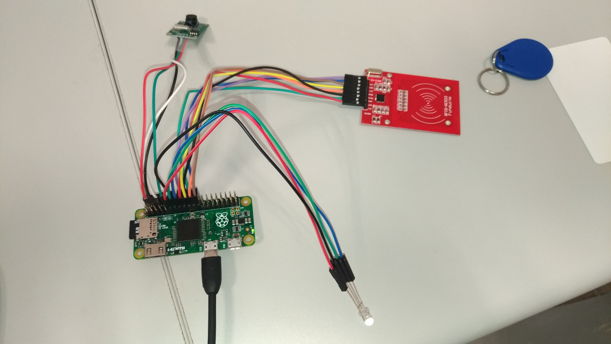

Setup the pzcmdr
================

In the following paragraphs, we will describe how to setup the system for executing commands when an RFID UID or QR-Code is detected.

Hardware Wiring
---------------

This project was developed based on the following hardware components:

*   Raspberry Pi Zero (v1.2)
*   RC522-compatible RFID reader
*   Serial Camera (Adafruit [Miniature TTL Serial JPEG Camera with NTSC Video](https://www.adafruit.com/product/1386))
*   RGB LED (common cathode)

The wiring of the components are described below.

### RC522 and Pi Zero

RC522 Pin | Pi Zero Pin
:--------:|:----------:
 VCC      | 17
 RST      | 22
 GND      | 20
 MISO     | 21
 MOSI     | 19
 SCK      | 23
 NSS      | 24
 IRQ      | 18
 
 ### Serial Camera and Pi Zero
 
 Camera Pin | Pi Zero Pin
 :---------:|:----------:
  5V        | 4
  TX        | 10
  RX        | 8
  GND       | 6
 
 ### RGB LED and Pi Zero Pin
 
 RGB LED | Pi Zero Pin
 :------:|:----------:
  R      | 11
  G      | 13
  B      | 15
  \-      | 14 (GND)
  

System Configuration
--------------------

The RC522 uses the SPI for communication. We need to use the configuration tool `raspi-config` to enable SPI support:

    Interfacing Options
        P4 SPI
            Would you like the SPI interface to be enabled? --> *Yes*

The Raspbian enables the serial console by default. To allow the serial camera to access the serial port
without resource contention, we need to disable the serial TTY while enabling the serial port.
Using the configuration tool `raspi-config`, choose the options in the menu:

    Interfacing Options
        P6 Serial
            Would you like a login shell to be accessible over serial? --> *No*
            Would you like the serial port hardware to be enabled? --> *Yes*

Software Installation
---------------------

### Install the Prerequisites

The application is developed to use Python `async` and `await` feature. Therefore, Python 3.5+ is required.
You may install it in Raspbian (stretch) by

    apt install python3 python3-pip

Then, install the following Python packages:

*   `pip3 install pi-rc522`
*   `pip3 install PyDispatcher`
*   `pip3 install pyserial-asyncio`
*   `pip3 install zbar-py`
*   `pip3 install pillow`
    
There are two dependent native libraries to install:

*   `apt install libzbar-dev`
*   `apt install libatlas-base-dev`

If you would like to use the `qrcode_gen.py` script, an additional Pyhton package is needed:

* `pip3 install qrcode`

### Install the Application

The code for the application is located in the `src/` folder. It is organized as follows:

*   `main.py` The script to launch the application.
*   `cmdr/` conatins the modules of the application.
*   `config/` conatins the configuration files.
*   `scripts/` contains some helper scripts.

Simply copy the files in the `src/` folder to your installation directory. For security concerns, my
suggestion is to make the configuration files in `config/` be only readable by the executing
user.

Quick Start
-----------

If things goes smoothly, the application should just work by the command:

    python3 main.py

Software Configuration
----------------------

There are two default configuration files in `config/`. The `cmds.py` lists the available commands that can be executed.
The `iddb.py` contains the IDs (UID for RFID and code for QR-Code image) that are recognized by the application.
Please read the comments in the files to learn how to define a new entry in the configuration.
If you choose to define your own configuration files without altering the default ones, you may supply the
file names when starting the application:

    python3 main.py --iddb ./config/my_iddb.py --cmds ./config/my_cmds.py
    

The application uses the logging facility to produce log. You may modify `main.py` to customize the logging configuration.
In addition, if you would like to only the change the log level from INFO (the default) to, say, DEBUG, envionment variable can be used:

    PZCMDR_LOGLEVEL=DEBUG python3 main.py

Software Execution
------------------

After the application is started, we can send the following signals to the process:

*   `USR1` is used for reloading configuration files.
*   `USR2` is used for toggling the saving of sensed ID, such as RFID's UID.
*   `TERM` and `INT` are used for terminating the program.

For example, supposed the PID of the program is 7130, you may reload the 
configuration files by the command:

    kill -USR1 7130

In the above procedure, we assume that the application is installed for the user `pi`.
The user is allowed to access GPIO, SPI and serial port.
However, if the application is installed for another user account, please ensure that the required permissions
to access the hardware and software are assigned to the user.

Addition Setup
==============

If you would like to execute a command on a remote host, please refer to the [`EthernetGadgetConfiguration.md`](networking/EthernetGadgetConfiguration.md) 
and [`SshLoginByKey.md`](networking/SshLoginByKey.md) to setup the network access.

----

