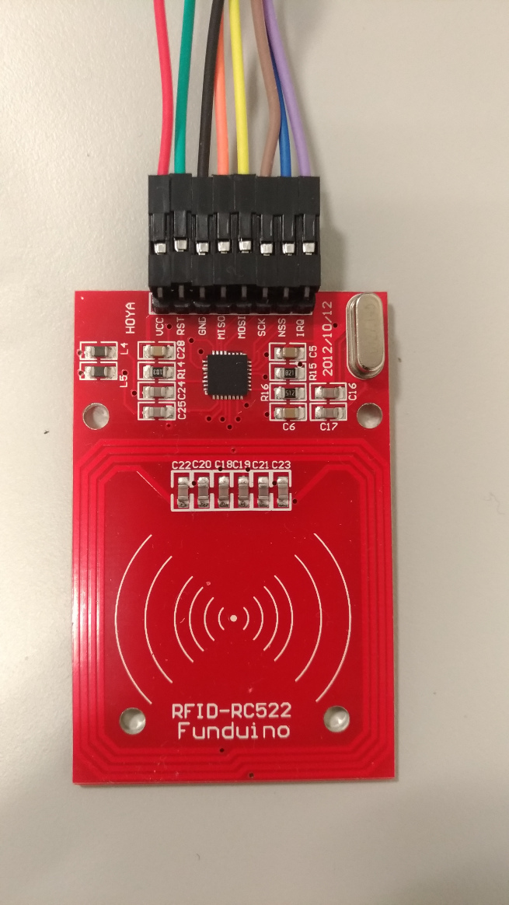

Attaching RC522 to Pi Zero and Sensing the Tags
===============================================

The first prototype is to read RFID tags from within the Raspbian system.

Quick Start
-----------

The RC522 is popular in many RFID related projects.
According to the [pi-rc522](https://github.com/ondryaso/pi-rc522), we connect our RC522 module to Pi Zero as follows:

RC522 Pin | Pi Zero Pin
:--------:|:----------:
 VCC      | 17
 RST      | 22
 GND      | 20
 MISO     | 21
 MOSI     | 19
 SCK      | 23
 NSS      | 24
 IRQ      | 18

Installing the package is easy by

    pip install pi-rc522 (for Python 2)

or

    pip3 install pi-rc522 (for Python 3)

Copy the sample code, save it to a script file, and execute it to see the reader working.
The result is encouraging because we make the RFID reader sensing tags with only a few lines of code.
Then, we pressed `Ctrl-C` to terminate the program.
When restarting the program, we noticed some extra messages related to GPIO resources.
Apparently the cleanup routine was not properly finished.
We quickly wrapped the code in a `try` block and moved the `cleanup()` call to the `finally` block.
This ensures that the cleanup routine would be properly executed.

Logging
-------

During the development, we would like to monitor the UID sensed from the tag.
We replaced the `print()` function calls with the `logging` facility because
it is much more flexible to use. We can categorize messages with a *log level*.
We can set a threashold level that turns off all the messages higher than that level.
The output device is also configurable. All the configuration is done at the beginning of the main thread.

Associate UID and Command
-------------------------

The development came to the point that modularization was needed.
We defined the RFID related operations in one class and a general command execution mechanism in another.
A dictionary was defined to map the sensed UID to the corresponding command name.
Another dictionary was defined to map the command name to the command code.
When a command is determined, we use `exec()` to execute the code.

Efficiency Concerns
-------------------

The `exec()` function allows two types of input. The first one is a string of script; the second one
is a pre-compiled Python code object.
The former type requires script parsing each time we invoke `exec()`.
The latter type is proper for executing the same command multiple times.
To produce the pre-compiled code, use `compile()` like this:

    precompiled_code = compile("the python script", '<string>', 'exec')

Executing a Shell Command
-------------------------

If the command is a shell command, the `subprocess` module provides the functionality:

    subprocess.Popen('the shell command', shell=True)

We can combine the `compile()` and `subprocess` to produce a pre-compiled code for invoking shell command.
For example,

    precompiled_code = compile("""
    import subprocess
    p = subprocess.Popen('ls -l', shell=True)
    """, '<string>', 'exec')

Handling Child Process Termination
----------------------------------

Using the above approach to execute a shell command would leave a *zombie process* after the command is finished.
This is due to the `Popen()` creates a child process for starting the shell (which is then executing the specified command).
After a child process is finished, the process memory is released.
However, the entry in the process table is not cleared until the parent process reads the return status
(the return value of the main() function).

To avoid the zombie process, we need to handle the siganl `SIGCHLD`. The related functions are defined in the `signal` module.

    signal.signal(signal.SIGCHLD, handling_function)

We chose a simple appraoch to handle the signal: using `os.wait(0, 0)` to poll the processes once.

    def handling_function():
        os.wait(0,0)

More Signal Handling
--------------------

The application is intended to be a background process (a daemon).
To terminate a daemon process, we send the *termination* signal (`SIGTERM`).
It is different from the signal generated by `Ctrl-C` (`SIGINT`).
`SIGTERM` is the signal when we use the `kill` command or the `kill()` system call to terminate a process.
`SIGINT` is also used for terminating a process but it is typically triggered from the user input device, e.g., `Ctrl-C` keystroke.
By default, Python intercepts the two signals and applies its own handling procedure.
After the procedure, the `SIGINT` handler raise the `KeyboardInterrupt` exception for application-level handling.
We prefer to treat both siganls equal. Therefore the two signals are associated to the same function for *graceful shutdown*.
Thus, we decided to define the `SIGTERM` and `SIGINT` handling in the application.
The graceful shutdown is performed by explicitly calling `exit()` in the handler.
After Python handles the exiting event, the `SystemExit` exception is raised.
This exception forces the reader loop being terminated.

Configuration File Reloading
----------------------------

Many daemon programs are designed to reload the configurations without restarting the program.
One of the implementation approaches is to handle the user-defined signal `USR1` or `USR2`.
Our application configurations are defined as two dictionaries in two module files.
Thus, they are loaded by using the `import` statement.
To reload a module, the `importlib` module contains the `reload()` function to do trick.
Finally, we had an `USR1` signal handler that reloads the configuration modules.

Save UID to a File
------------------

UID is the secret information in our configuration. It should be carefully manipulated.
We can set the configuratin files to mode 0600 so that only the owner can access it.
We can further suppress UIDs from all the log messages.
However, there are cases that we need to view the sensed UID.
For example, we would like to add a new tag to the application for shutting down all the computers.
The UID should be obtained before it is added to the configuration file.
Therefore, we designed an `USR2` handler to save the next UID in an owner-only (0600) file.

The file is dynamically created. With the high-level `open()`, we can only specify the read/write mode.
To create a file for writing with the access permission 0600, the low-level `os.open()` should be used.

    fd = os.open('leak_uid.txt', os.O_CREAT | os.O_TRUNC | os.O_WRONLY, 0o600)
    with os.fdopen(fd, 'w') as f:
        f.write(str(uid))

The first line creates the file `leak_uid.txt` with permission 0600 for writing the UID information.
The second line calls the `os.fdopen()` to wrap the file descriptor as a file stream.
The third line writes the data.
The file stream `f` is defined within the `with` statement.
The `close()` is automatially invoked when leaving the *context*.

Group the Signal Handlers
-------------------------

A few signal handlers were specified in the application and some of them share the object/function references.
To avoid the related definitions scattered in the code, we decided to group all the signal-handling definitions in a class for easy maintenance.

Summary
-------

This is the first prototype. We started from the pi-rc522 sample code and incrementally added new features.
* The program senses RFID tags infinitely until it is killed (`SIGTERM`) or interrupted (`SIGINT`).
* A recognized UID triggers the excution of the corresponding command.
* The graceful shutdown procedure is implemented to ensure the GPIO is released.
* The configurations are reloaded when receiving `SIGUSR1`.
* The UID information is not included in the log messages.
* To save the UID information to a owner-only file, send `SIGUSR2` to the process.

