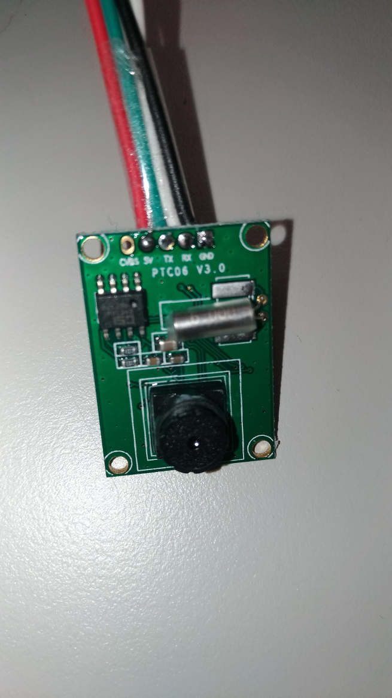

Attaching the Serial Camera to Read QR-Code
===========================================

The RFID-based pzcmdr worked as expected.
The response of the system was acceptable.
However, one UID to one command is the physical limitation.
We need to carry several RFID tags in case we need to execute the commands.
The idea of QR-Code came to our minds.
It is easy to generate many QR-Codes and save them in a mobile phone.
The drawback is that it is slower than RFID sensing.

Serial Camera
-------------

To scan for a QR-Code, we need a camera to capture the image.
The Pi Zero v1.2 does not have a builtin camera port.
One of the solutions is to use a camera that communicates through the serial port.
Due to the bandwidth of serial port transmission, the capturing speed is pretty limited.
Fortunately it is not a problem in our application.
We bought the [serial camera from Adafruit](https://www.adafruit.com/product/1386).
On the product page, there are references to the protocol specifications and the reference code.

We attached the camera module to Pi Zero. The wiring is listed below:

 Camera Pin | Pi Zero Pin
 :---------:|:----------:
  5V        | 4
  TX        | 10
  RX        | 8
  GND       | 6

Note that the Raspbian should be configured to enable the UART without a TTY. Otherwise the TTY program would interfere with our application.

We spent many hours experimenting on the camera control.
In short, the source code is the most reliable technical document :smile:.
Here is a short summary of the camera control used in pzcmdr:

* The image resolution setting persists across system boots. Therefore, using an external tool to set the parameters (provided as the source code `scripts/vc0706/set_resolution.py`).
* The default baudrate is 38400bps. We set it to 51200bps at application start and revert to the default when stopping the application. The design decision is that we need to be able to connect to the camera without guessing the speed when pzcmdr is not running. If there is any problem connecting to the camera, use `scripts/vc0706/reset.py` to reset it.
* To capture an image, issue the *capture* command to the camera. It freezes the capturing buffer and makes the JPEG-compressed stream ready. Then, issue the *get buffer length* command to obtain the number of bytes of the JPEG stream. Afterwards, issue the *read buffer* command(s) to read all the bytes.
* Before capturing the next image, the *resume* command should be sent to the camera for updating the frame data. There should be some interval between the *resume* and the *capture* command but we didn't determine the least amount of time required.
* The *reset* command resets the camera and the baudrate is reverted to the default.
* The VGA resolution (640x480) requires a few seconds to transfer. Thus we decided to reduce the resolution to QVGA (320x240) to limit the transmission time within two seconds.

The necessary control procedures were learned. The next is to integrate them to pzcmdr as the asynchronous tasks.

pyserial-asyncio
----------------

Serial port communication is supported by the `pyserial` package. The asyncio extension is provided in the `pyserial-asyncio` package.
Unfortunately, the documentation is quite minimal. We had to explore the API in Python shell and the source repository.
It provides the low-level asyncio *Transport/Protocol* implementation and the high-level abstraction *stream reader/writer* interfaces.
We chose the reader/writer to simplify the implementation because we only need the asynchronous support.
To obtain the reader and writer of the serial port, the suggested approach is to use `open_serial_connection()`

    reader, writer = await serial_asyncio.open_serial_connection(url='/dev/ttyAAM0', baudrate=38400)

The `url` parameter is very useful because it allows to connect to various resourcesthe supporting [serial-like protocols](https://pythonhosted.org/pyserial/url_handlers.html#urls).
The `spy://` protocol is a very useful debugging tool. It logs the communication to the specified file:

    reader, writer = await serial_asyncio.open_serial_connection(url='spy:///dev/ttyAAM0?file=debug.log', baudrate=38400)

QR-Code Generation
------------------

The image capturing functionality was ready. We proceeded to the next development phase -- the QR-Code related functions.
First of all, we need to generate a few QR-Codes.
The `qrcode` package is popular and easy to use.
Simply load the module and call a function to eocode the given message to the QR-Code as a PIL image.
Then, save the image using the `PIL` or the compatible `pillow` library.

    import qrcode
    qr_code = qrcode.make(date="my message")
    qr_code.save('test.jpg', format='jpeg')

QR-Code Scanning
----------------

Before the QR-Code is decoded, the location of the QR-Code should be determined from the image. This is the scanning process.
The native library `zbar` can handle the scanning of barcodes anf QR-Codes.
Many people suggest the `qrtools` as the Python language binding library.
However, it is based on zbar Python2 binding and not useable in our project.
Thank the `zbar-py` package's Python3 binding, we could continue the development.
The gray-level `numpy` image is scanned by the zbar scanner.
The detected QR-Codes are contained in the resurned result list.

    import zbar
    import numpy
    scanner = zbar.Scanner()
    result = scanner.scan(numpy.asarray(gray))

Put Them Together
-----------------

The major processing procedures were determined.
To put them together, some additional efforts were required.

* Define the software siganls for `PyDispatcher`.
* Periodically capture an image - put the capturing procedure in a loop.
* Decode the captured JPEG stream - wrap the JPEG data as an input stream by `io.BytesIO()`;  use `Image.open()` to decode the input stream.
* Extract the decoded message and look for the corresponding command name - define the lookup dictionary for QR-Codes.
* Design the graceful shutdown and the reload procedures.

Summary
-------

In this prototype, we add the QR-Code scanning support into the application.
Based on the previous asyncio design experiences, the new functionality was integrated without problem.

* the use of `pyserial-asyncio` extension
* the control of VC0706 based serial camera
* the QR-Code scanning using `zbar-py`

----

